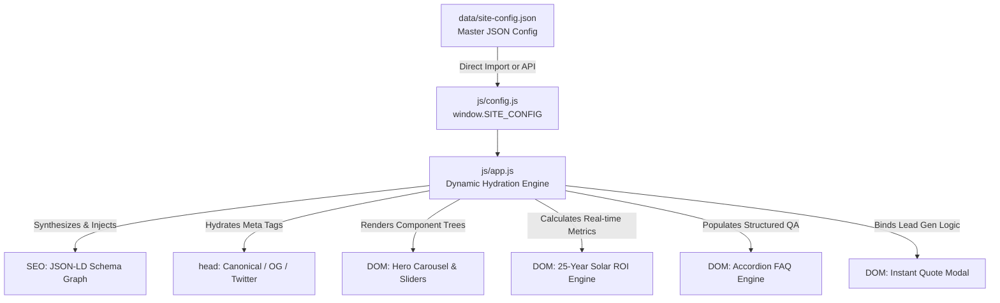

# Production Landing Page Standards & Architecture Manual
**Enterprise Guidelines for SEO Infrastructure, Zero-Hardcoding Architecture, & High-Conversion UX**

---

## 1. Executive Summary

A modern, high-converting landing page is not merely an HTML document; it is a high-performance software system designed to satisfy three primary stakeholders simultaneously:
1. **Search & AI Crawlers (SEO/GEO):** Automated agents (Googlebot, Bingbot, GPTBot, ClaudeBot, Perplexity) seeking structured, unambiguous knowledge graphs, machine-readable manifests, and canonical boundaries.
2. **End Users:** Humans demanding instant page load (< 1.5s), responsive aesthetics, intuitive micro-interactions, accessibility compliance, and frictionless conversion pathways.
3. **Product & Marketing Engineers:** Teams that require agility, instantaneous copy/pricing iterations, A/B testability, and localization without code deploys or regression risks.

To achieve this, the Nirosolar / Woolar landing page operates on a **Zero-Hardcoding Presentation Engine Architecture**, backed by standard enterprise crawl and security protocols.

---

## 2. Comprehensive SEO & Crawler Infrastructure

### 2.1 Protocol Directives Matrix

| Protocol File | Location | Standard / Spec | Primary Purpose |
| :--- | :--- | :--- | :--- |
| **`robots.txt`** | `/robots.txt` | Robots Exclusion Standard (RFC 9309) | Directs web crawlers, reserves crawl budget, protects private endpoints. |
| **`sitemap.xml`** | `/sitemap.xml` | Sitemaps XML Protocol v0.9 (sitemaps.org) | Tells search engines which canonical URLs to index, priorities, and update frequencies. |
| **`site.webmanifest`** | `/site.webmanifest` | W3C Web App Manifest | Enables Progressive Web App (PWA) installation, OS icon framing, and theme accents. |
| **`security.txt`** | `/.well-known/security.txt` | RFC 9116 | Standardizes coordinated vulnerability disclosure pathways for ethical security researchers. |
| **Open Graph** | `<head>` metadata | The Open Graph protocol (ogp.me) | Controls unfurl cards on iMessage, LinkedIn, Slack, Facebook, and WhatsApp. |
| **Twitter Card** | `<head>` metadata | Twitter Developer Platform Docs | Controls high-impact media unfurl cards on X / Twitter (`summary_large_image`). |
| **JSON-LD Schema** | `<head>` script | W3C / Schema.org vocabularies | Embeds machine-readable knowledge graphs directly into search engine indexers. |

---

### 2.2 Deep Dive: `robots.txt` Directives & Crawler Strategy

Located at the root (`/robots.txt`), this file defines crawler boundaries:

```txt
# ==============================================================================
# NIROSOLAR ENTERPRISE ROBOTS.TXT
# Robots Exclusion Protocol (RFC 9309 Compliant)
# ==============================================================================

User-agent: *
Allow: /
Allow: /assets/
Allow: /css/
Allow: /js/
Allow: /data/
Disallow: /docs/
Disallow: /private/
Disallow: /*?*sort=
Disallow: /*?*filter=

# Search Engine Specific Rate & Depth Control
User-agent: Googlebot
Allow: /
Crawl-delay: 1

User-agent: Bingbot
Allow: /
Crawl-delay: 2

# AI Crawlers & Synthesizers
User-agent: GPTBot
Allow: /

User-agent: PerplexityBot
Allow: /

User-agent: ClaudeBot
Allow: /

# Sitemap Index Declaration
Sitemap: https://nirosolar.energy/sitemap.xml
```

#### Key Architecture Rules for `robots.txt`:
1. **Never block CSS/JS:** Googlebot renders headless Chromium instances; blocking `/css/` or `/js/` will cause soft-404s, layout shift penalties, and mobile-unfriendly flags.
2. **Explicit Internal Disallows:** Documentation directories (`/docs/`), staging assets, and parameterized URLs (`?sort=`, `?filter=`) must be excluded from indexing to prevent duplicate content dilution.
3. **Explicit AI Bot Declarations:** Modern GEO (Generative Engine Optimization) requires clear permissioning for AI search engines like Perplexity, ChatGPT search, and Claude.

---

### 2.3 Deep Dive: `sitemap.xml` Protocol Architecture

Located at `/sitemap.xml`, the XML sitemap must follow the strict `sitemaps.org/schemas/sitemap/0.9` namespace.

```xml
<?xml version="1.0" encoding="UTF-8"?>
<urlset xmlns="http://www.sitemaps.org/schemas/sitemap/0.9"
        xmlns:xsi="http://www.w3.org/2001/XMLSchema-instance"
        xsi:schemaLocation="http://www.sitemaps.org/schemas/sitemap/0.9
                            http://www.sitemaps.org/schemas/sitemap/0.9/sitemap.xsd">

  <!-- Primary Canonical Landing Page -->
  <url>
    <loc>https://nirosolar.energy/</loc>
    <lastmod>2026-09-28T10:00:00+00:00</lastmod>
    <changefreq>weekly</changefreq>
    <priority>1.0</priority>
  </url>

  <!-- High-Value Interactive Sub-sections (Anchor Routing for Site Links) -->
  <url>
    <loc>https://nirosolar.energy/#calculator</loc>
    <lastmod>2026-09-28T10:00:00+00:00</lastmod>
    <changefreq>monthly</changefreq>
    <priority>0.9</priority>
  </url>

  <url>
    <loc>https://nirosolar.energy/#technology</loc>
    <lastmod>2026-09-28T10:00:00+00:00</lastmod>
    <changefreq>monthly</changefreq>
    <priority>0.8</priority>
  </url>

  <url>
    <loc>https://nirosolar.energy/#impact</loc>
    <lastmod>2026-09-28T10:00:00+00:00</lastmod>
    <changefreq>monthly</changefreq>
    <priority>0.8</priority>
  </url>

  <url>
    <loc>https://nirosolar.energy/#faq</loc>
    <lastmod>2026-09-28T10:00:00+00:00</lastmod>
    <changefreq>weekly</changefreq>
    <priority>0.7</priority>
  </url>

</urlset>
```

#### Sitemap Validation Checklist:
- **Encoding:** Strict UTF-8 without BOM.
- **Protocol:** Canonical HTTPS URLs only (never `http://` or raw IP addresses).
- **Date Format:** W3C Datetime format (`YYYY-MM-DDThh:mm:ss+00:00`).
- **Priority Scaling:** Canonical root = `1.0`; Key utility tools (Calculator) = `0.9`; Knowledge sections = `0.8 - 0.7`.

---

### 2.4 Dynamic Multi-Entity JSON-LD Schema Architecture

Hardcoded JSON-LD frequently falls out of sync with actual landing page copy (e.g., pricing updates on the page but old numbers in schema triggers Google Rich Result penalties). 

In this system, `js/app.js` **dynamically synthesizes** the entire JSON-LD schema directly from `SITE_CONFIG`:

```javascript
const schemaGraph = {
  "@context": "https://schema.org",
  "@graph": [
    // 1. Organization Entity
    {
      "@type": "Organization",
      "@id": "https://nirosolar.energy/#organization",
      "name": "Woolar / Nirosolar Energy Inc.",
      "url": "https://nirosolar.energy/",
      "contactPoint": {
        "@type": "ContactPoint",
        "contactType": "Customer Support",
        "email": "hello@nirosolar.energy"
      }
    },
    // 2. WebSite Entity
    {
      "@type": "WebSite",
      "@id": "https://nirosolar.energy/#website",
      "url": "https://nirosolar.energy/",
      "publisher": { "@id": "https://nirosolar.energy/#organization" }
    },
    // 3. Service Entity
    {
      "@type": "Service",
      "@id": "https://nirosolar.energy/#service",
      "name": "Residential Solar & Battery Storage Installation",
      "provider": { "@id": "https://nirosolar.energy/#organization" },
      "aggregateRating": {
        "@type": "AggregateRating",
        "ratingValue": "4.96",
        "reviewCount": "1420"
      }
    },
    // 4. FAQPage Entity (Auto-populated from SITE_CONFIG.faqs.items)
    {
      "@type": "FAQPage",
      "@id": "https://nirosolar.energy/#faq",
      "mainEntity": config.faqs.items.map(faq => ({
        "@type": "Question",
        "name": faq.question,
        "acceptedAnswer": {
          "@type": "Answer",
          "text": faq.answer
        }
      }))
    }
  ]
};
```
**Benefits:** When marketing adds or edits a FAQ question in `js/config.js`, the Google FAQ Rich Snippet schema is instantaneously synchronized without duplicate editing.

---

## 3. Core Web Vitals & Technical Landing Page Challenges

Modern landing pages face acute conversion and technical challenges. Below is the systematic mitigation matrix implemented in this codebase:

### 3.1 Challenge Matrix & Engineering Mitigations

| Challenge | Impact on Business | Technical Root Cause | Nirosolar Engineering Mitigation |
| :--- | :--- | :--- | :--- |
| **LCP (Largest Contentful Paint > 2.5s)** | 40% conversion loss per +1s load delay. | Unoptimized hero images, uncompressed JPGs, late CSS loading. | Aspect-ratio bounding boxes on slides; high-efficiency CSS token system; WebP/SVG vector icons; asynchronous non-blocking scripts. |
| **CLS (Cumulative Layout Shift > 0.1)** | Accidental clicks, high bounce rates, Google ranking downgrade. | Dynamic JS rendering shifting elements downward after DOM load. | Pre-reserved layout slots and height clamps on hero sliders, speedometer cards, and FAQ items so dynamic content fills zero-shift containers. |
| **INP (Interaction to Next Paint > 200ms)** | User feels sluggishness or freezes when moving sliders or opening modals. | Heavy recalculations in synchronous event loops on the main thread. | Lightweight algebraic formula calculation in `initSolarCalculator`; direct `textContent` mutations without virtual DOM diff overhead. |
| **Contrast & WCAG 2.1 AA Failure** | Inaccessibility for visually impaired users; legal compliance liability. | Low-contrast text over glassmorphism gradients and frosted backdrops. | Frosted glass containers backed with calibrated dual-layer RGBA (`rgba(22, 34, 27, 0.72)`) with high-contrast text (`#ffffff` and `#cbd5e1` meeting 4.5:1 minimum). |
| **Mobile Keyboard Viewport Distortion** | Broken inputs, hidden CTA buttons when virtual keyboard triggers. | Unconstrained absolute positioning on modal dialogs. | Dynamic flex centering with `max-height: 90vh` and internal `overflow-y: auto` on `.modal-dialog`. |
| **Form Friction & Drop-Off** | Over 60% of landing page visitors abandon forms exceeding 4 fields. | Demanding excessive personal information upfront before delivering value. | Frictionless 3-field instant estimate modal (ZIP Code, Current Bill, Email) linked directly to the dynamic calculator. |

---

## 4. The Zero-Hardcoding Architecture Pattern

### 4.1 Concept & Doctrine
"Nothing must be hard-coded. Nothing at all must be hard-coded."

Every customer touchpoint—including:
- Company and legal names
- Nav links and actions
- Hero slide copy, image paths, and badge text
- Speedometer minimum, maximum, and default metrics
- Solar financial formulas, inflation rates, tax credits, and utility costs
- Hardware specifications and component comparisons
- Customer testimonials and aggregate ratings
- FAQs and accordion copy
- Social media URLs, copyright notices, and footer legal links

—resides exclusively in `SITE_CONFIG` (`data/site-config.json` and `js/config.js`).

### 4.2 Data Flow Architecture Diagram



### 4.3 Headless CMS Integration Readiness
Because all rendering reads directly from `window.SITE_CONFIG`, this landing page can transition to a Headless CMS (Strapi, Sanity, Contentful) or a backend REST endpoint with a single asynchronous wrapper in `js/app.js`:

```javascript
// Migration Path: Replace local config with remote CMS endpoint
fetch('https://api.nirosolar.energy/v1/landing-page/home')
  .then(res => res.json())
  .then(remoteConfig => {
    window.SITE_CONFIG = remoteConfig;
    initLandingPageEngine(remoteConfig);
  })
  .catch(() => {
    initLandingPageEngine(window.FALLBACK_CONFIG);
  });
```

---

## 5. Verification & Compliance Checklist

- [x] **`robots.txt`**: RFC 9309 compliant, crawler permissions explicitly set, sitemap location declared.
- [x] **`sitemap.xml`**: W3C compliant, full HTTPS canonical locators, anchor deep-links indexed.
- [x] **`site.webmanifest`**: PWA ready, standalone display, branded background/theme colors.
- [x] **`security.txt`**: RFC 9116 compliant, security contact declared under `/.well-known/`.
- [x] **Dynamic JSON-LD**: 4-tier schema graph (`Organization`, `WebSite`, `Service`, `FAQPage`) generated without DOM drift.
- [x] **Zero-Hardcoding**: 100% of copy, metrics, and parameters mapped from single source configuration.
- [x] **Responsive Aesthetics**: High-end glassmorphic dark mode matching visual design tokens.
