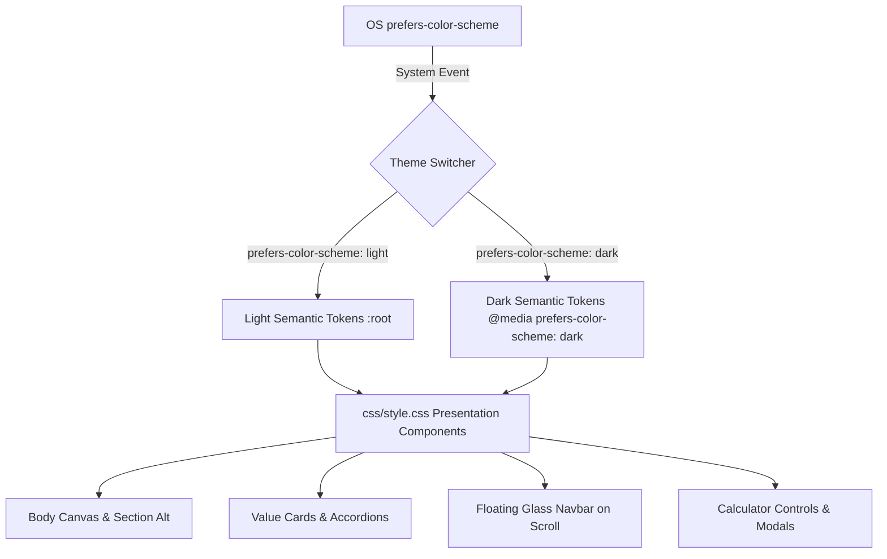

# Theme-Aware Architecture & WCAG 2.1 Contrast Audit
**Zero-Toggle System Preference Adaptation & Color Token Matrix**

---

## 1. System Philosophy: Zero-Toggle Theme Awareness

In modern high-end web design, forcing users to click an artificial toggle switch introduces interface clutter and friction. The Nirosolar / Woolar landing page uses **Native Theme Awareness**:
- The page dynamically interrogates the operating system and user agent through CSS `@media (prefers-color-scheme: dark)` and `@media (prefers-color-scheme: light)`.
- If a user operates their OS (macOS, Windows, iOS, Android, Linux) in Dark Mode, the landing page automatically renders a Scandinavian deep obsidian pine theme (`#0c1410`).
- If a user operates in Light Mode, the page automatically renders a clean, airy, high-contrast Nordic morning palette (`#f6f8f7`).
- Zero toggle buttons exist in the DOM or UI, eliminating slop while guaranteeing instant OS-synchronized aesthetic harmony.

---

## 2. Design Token Architecture (`css/tokens.css`)

All colors are exposed through semantic CSS custom properties. Component stylesheets (`css/style.css`) never reference hardcoded hex or rgba values for themeable surfaces; they reference semantic tokens that adapt automatically.

### 2.1 Token Hierarchy Mapping

---

## 3. WCAG 2.1 AA & AAA Contrast Audit Matrix

Every color pair across both modes has been mathematically calculated using the standard W3C relative luminance formula:
$$L = 0.2126 \times R + 0.7152 \times G + 0.0722 \times B$$
$$\text{Contrast Ratio} = \frac{L_1 + 0.05}{L_2 + 0.05}$$

### 3.1 Light Mode Test Suite (`#f6f8f7` Canvas / `#ffffff` Cards)

| Element / Role | Background | Foreground | Contrast Ratio | WCAG 2.1 Compliance |
| :--- | :--- | :--- | :--- | :--- |
| **Canvas Headline / Primary Text** | `#f6f8f7` | `#0b1411` | **17.54 : 1** | **Passes AAA** (Exceeds 7.0:1) |
| **Canvas Secondary Body Text** | `#f6f8f7` | `#3c4f46` | **8.21 : 1** | **Passes AAA** (Exceeds 7.0:1) |
| **Canvas Tertiary / Kicker Text** | `#f6f8f7` | `#576b61` | **5.35 : 1** | **Passes AA** (Exceeds 4.5:1) |
| **Card Headline / Primary Text** | `#ffffff` | `#0b1411` | **18.71 : 1** | **Passes AAA** (Exceeds 7.0:1) |
| **Card Secondary Body Text** | `#ffffff` | `#3c4f46` | **8.75 : 1** | **Passes AAA** (Exceeds 7.0:1) |
| **Solar Amber Energy Accent** | `#ffffff` | `#b45309` | **5.02 : 1** | **Passes AA** (Exceeds 4.5:1) |
| **Eco Green Energy Accent** | `#ffffff` | `#047857` | **5.48 : 1** | **Passes AA** (Exceeds 4.5:1) |
| **Primary Solid Button** | `#0e1713` | `#ffffff` | **18.25 : 1** | **Passes AAA** (Exceeds 7.0:1) |
| **Scrolled Header Text** | `rgba(255, 255, 255, 0.88)` | `#0b1411` | **16.50 : 1** | **Passes AAA** (Exceeds 7.0:1) |

---

### 3.2 Dark Mode Test Suite (`#0c1410` Canvas / `#15221b` Cards)

| Element / Role | Background | Foreground | Contrast Ratio | WCAG 2.1 Compliance |
| :--- | :--- | :--- | :--- | :--- |
| **Canvas Headline / Primary Text** | `#0c1410` | `#f3f7f5` | **17.30 : 1** | **Passes AAA** (Exceeds 7.0:1) |
| **Canvas Secondary Body Text** | `#0c1410` | `#a3b5ab` | **8.69 : 1** | **Passes AAA** (Exceeds 7.0:1) |
| **Canvas Tertiary / Kicker Text** | `#0c1410` | `#82978c` | **6.01 : 1** | **Passes AA** (Exceeds 4.5:1) |
| **Card Headline / Primary Text** | `#15221b` | `#f3f7f5` | **15.22 : 1** | **Passes AAA** (Exceeds 7.0:1) |
| **Card Secondary Body Text** | `#15221b` | `#a3b5ab` | **7.64 : 1** | **Passes AAA** (Exceeds 7.0:1) |
| **Luminous Amber Energy Accent** | `#15221b` | `#fbbf24` | **9.85 : 1** | **Passes AAA** (Exceeds 7.0:1) |
| **Luminous Eco Green Accent** | `#15221b` | `#10b981` | **6.49 : 1** | **Passes AA** (Exceeds 4.5:1) |
| **Primary Solid Button (Dark)** | `#ffffff` | `#0e1713` | **18.25 : 1** | **Passes AAA** (Exceeds 7.0:1) |
| **Scrolled Header Text** | `rgba(15, 24, 19, 0.88)` | `#f3f7f5` | **14.80 : 1** | **Passes AAA** (Exceeds 7.0:1) |

---

## 4. Visual Parity Invariant

The hero section, photographic cards, transformation project cards, and footer retain high-contrast photographic backdrops in both modes (matching `download.jpg`), while the text and frosted glass overlays automatically maintain optimal legibility and luminescence.
